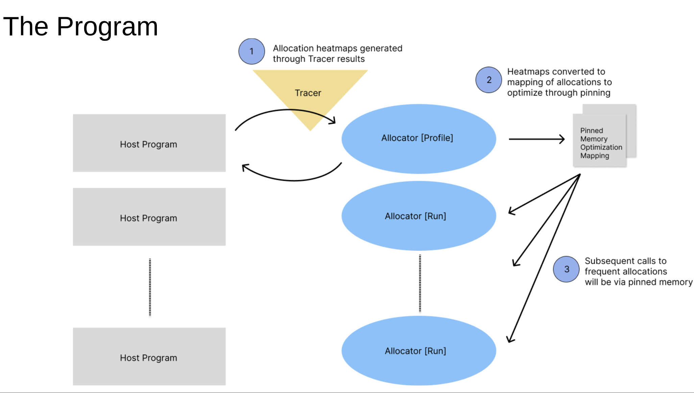
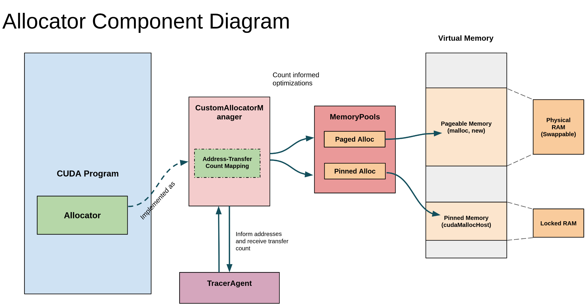

# Design Summary

The project has two core components: The tracing framework, which allows tracing memory behavior of unmodified
CUDA programs and exposes and API to retrieve that information, and a custom allocator which uses the hints
provided by an instance of the tracing framework during a profiling run to inform allocation pinning decisions
in subsequent runs.

The overall motiviation is to work towards optimizing the interaction between GPU applications and devices
and the Linux operating system, particularly when it comes to the data pipeline, and memory I/O. 

## 1. Tracing Framework

### 1.1 Summary and Operation Modes

The tracing framework works both as a stand-alone executable and as an included library.

The stand-alone executable takes in a PID, traces it, and dumps the traced results to disk.
This might be used for profiling existing CUDA applications. This mode does not require 
modifing the CUDA application, so long as it restricts itself to the set of functions targeted
by our project.

### 1.2 Motivation

Many profiling tools exist for CUDA applications. These include application-level profilers,
like the Pytorch profiler, and runtime-level profilers like the NVCC profiler from NVIDIA.

These profilers are extremely detailed, but have two major downsides.

**1. Overhead and Predictability** — The majority of existing profilers are focused on 
profiling during the development phase of applications, and so are not designed to run
continuously or in a production environment. They often have significant, unpredictable 
overhead that makes running them outside of development infeasible, and they do not expose
good APIs for ongoing components of the program (like a memory allocator) to take hints from
their profiling.

**2. Lack of Operating System Context** — Existing profilers often lack the ability to provide insights
into the operating system behavior, because they are primarily designed and implemented in userspace. They
do not provide insight into how the OS or driver are managing memory, or the page cache for example.

The goal of the tracing framework is to build a profiler that is much less detailed than
existing profilers, but addresses these two issues to allow continuous, low-overhead monitoring
with insight from the kernel level.

### 1.3 Design
The design of the tracing framework is shown in the image below.

#### 1.3.1 The TracerAgent

The tracer agent is a class that manages a MemHistory and a ProbeManager object, and
exposes an API to allow both control over tracing (mainly via start and stop methods) and access
to tracing information 'live' to advise running components.

To connect the ProbeManager and MemHistory, the agent launches a processing thread, which 
reads from a thread-safe queue passed to the ProbeManager and submits events to the MemHistory object.

The TracerAgent both exposes a generic accessor that allows arbitrary (but thread-safe) access to the
MemHistory object, and specific accessors optimized for fast retrieval of 'hotspots', or allocations
that are frequently transfered to the GPU, and 'coldspots', which are rarely transfered to the GPU.

The agent also allows dumping the current MemHistory object to a human readable JSON or compressed
binary database on disk.

#### 1.3.2 MemHistory 
The MemHistory object manages tracking the history of allocations, based on events passed in from
the `RecordEvent` method. It is safe for concurrent access from multiple threads, using a reader-writer
mutex.

It uses an efficient multi-indexed map to track an `AllocationHistory` object for each allocation 
involved in recieved events. The map allows fast access both by start address and by transfer count,
with the latter intended for optimizing calls to the advisory API.

For each start address, there may be multiple AllocationHistory objects, but only some are considered
'active' at any given time. 

MemHistory objects also have the capability to serialize their contents to disk, either in JSON
or compressed binary.

#### 1.3.3 AllocationHistory

A single AllocationHistory manages the history and status of an individual allocation. AllocationHistories 
are safe for concurrent access from multiple threads.

The AllocationHistory keeps some static information describing the allocation (an `Allocation` object), which
includes the start address, size, and the call site and number of the initial allocation call for the object.

To track events, the AllocationHistory keeps a timestamp-ordered multiset of events. As events are submitted,
the object updates the events multiset and, updates state-tracking variables (like the current state, and the 
transfer count). These could be calculated by traversing events, but are kept as variables for fast access.

#### 1.3.4 ProbeManager and eBPF 

The ProbeManager manages the probes that provide sources for events passed to the MemHistory object. The probes themselves
are eBPF user and kernel function probes, that hook into user and driver functions and snoop arguments efficiently. 

eBPF is the core technology that enables the tracing framework, as it provides a way to load safe, userspace-compiled 
bytecode into the kernel and retrieve kernel information live, with minimal overhead. 

Each eBPF probe is attached individually, and provided a ringbuffer which the ProbeManger monitors using epoll. The polling
thread in the ProbeManager merges events from all the probe ringbuffers into the event queue provided at initialization
by the TracerAgent.

## 2. Custom Allocator

The custom allocator takes advice from the TracerAgent to make decisions about whether 
or not to pin particular allocations.

### 2.1 Background/Motivation

Pageable memory can be swapped in and out of the OS, leading to potential page faults. Instead, we can pin memory, which locks it to the RAM. However, we also don’t want to naively pin all memory since we may not have enough memory, especially in the context of Deep Learning tasks. As such, we want to implement smart pining, only pinning when necessary. Ideally, we want to pin high-transfer hotspots and not pin the coldspots. 

### 2.2 Design

#### 2.2.1 CustomAllocatorManager
The CustomAllocatorManager handles smart memory allocation by operating in two modes: "Profile" mode, which fully pins memory and uses Tracer logic, and "Use" mode, which performs smart pinning based on information saved by the Tracer. It allocates memory by calling PinnedMemoryPool for frequently transferred hotspots and NonPinnedMemoryPool for infrequently transferred coldspots.

#### 2.2.2 MemoryPools
MemoryPools components handle memory allocations calls from CustomAllocatorManager instances. 
Composed of two classes: PinnedMemoryPool and NonPinnedMemoryPool. These two classes each have functions to allocate and deallocate memory. Non-pinned memory uses malloc underneath the hood and Pinned memory uses cudaMallocHost. 

# Allocator Benchmarks

Our benchmarks are run on synthetic workloads, that simulate those with 'hotspots'. 

In particular we have the following two type of calls:
1. 2 calls of frequently transferred memory between host and device using CudaMemcpy. 175 transfer from host to device, and 175 transfers back.
2. 25 calls of infrequently transferred memory. 1 transfer from host to device and 1 transfer back.

In the following graphs, we have the following labels:
- Unpinned - always uses malloc() to allocate unpinned memory 
- Pinned - always use cudaMallocHost() to allocate pinned memory
- CustomAllcocatorManager:Profile - "profile" mode, to gather a memory history
- CustomAllcocatorManager:Optim - “use” mode that takes in a history and uses it to make allocation decisions

We compare performance of both CustomAllcocatorManager modes, Unpinned, and Fully Pinned, both on runtime and 
percentage of memory pinned.

Our CustomAllcocatorManager performs better than full pinning for less than 32MB and slightly worse than full pinning for larger allocation size. It performs significantly better than no pinning.

Performance CustomAllcocatorManager and no pinning decreases a lot at the 32MB threshold. This may be due to the performance drop in malloc() when we allocate more than 32MB at a time.

CustomAllocatorManager pins only 7% of memory (the “hotspots”) but performs better or slightly worse than full pinning and much better than no pinning. 

CustomAllocatorManager is almost identical to full pinning in “profile” mode but includes the Tracer logic. The graph above shows that the overhead from Tracer is very small and negligible.
